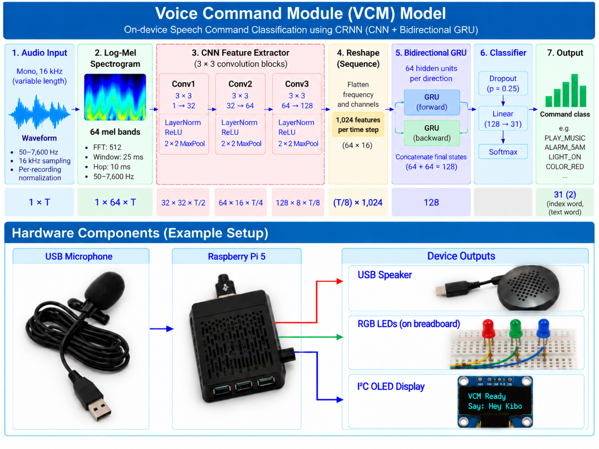

# Voice Command Module - CRNN

## Run

```bash
git clone https://github.com/markandrian30/vcm-crnn.git
cd vcm-crnn
sudo apt install -y ffmpeg espeak-ng libportaudio2
python3 -m venv .venv
source .venv/bin/activate
pip install -r requirements.txt
python main.py
```

Place `music/` and `responses/` beside `main.py`. Say **Hello Kibo before each command**; **Sagittarius** to exit. Accepts confidence **above 25%**; otherwise says "Command not recognized" during an active command session. Enable I2C for the OLED.

## Submission details

| Item | Location / details |
|---|---|
| GitHub | [markandrian30/vcm-crnn](https://github.com/markandrian30/vcm-crnn) - public - [MIT code licence](LICENSE) |
| Dataset | [Hugging Face source](https://huggingface.co/datasets/airimonda/ai231-me2-voice-commands) - [Command manifest](data/command_manifest.csv) - [Full training manifest](data/full_manifest.csv). Source access terms apply; licence/DOI verification pending. |
| A100 cluster | DGX2 (`ai-n002`) - 1 x A100-SXM4, 40 GB (GPU 2) - seed 42 |
| Model weights | [Selected checkpoint](model/best_model.pt) - weights licence pending |

## 1. Model



**CNN + bidirectional GRU:** 64 hidden units per direction, dropout 0.25, **515,937 parameters**, 33 outputs (31 commands + wake/exit). Diagram corrections: reshape is 128 x 8; classifier is 128 -> 33; outputs are 31 commands + wake/exit. The alarm example is ALARM_6_00AM; wake phrase is Hello Kibo.

## 2. Dataset

Main dataset: [airimonda/ai231-me2-voice-commands](https://huggingface.co/datasets/airimonda/ai231-me2-voice-commands). **Preprocessing matched command phrases and slot values, removed HF filenames already represented in GitHub, and reserved command holdout speakers.** GitHub synthetic recordings are included.

| Split | GitHub | HF | Total |
|---|---:|---:|---:|
| Training | 14,070 | 316 | 14,386 |
| Validation | 1,806 | 176 | 1,982 |
| Test | 1,614 | 56 | 1,670 |
| **Total** | **17,490** | **548** | **18,038** |

**8.90 hours - 252 command speaker IDs - 19 intents - 31 command classes.** Another 1,044 wake/exit recordings are training-only. Of 615 eligible HF candidates, 67 were reserved for holdout.

**Command schema** - 13 fixed intents + 6 slotted intents; 3 phrase variations per command class.

| Intent | Phrase variations | Slot values |
|---|---|---|
| ALARM | Alarm {time}; Wake me up at {time}; Set an alarm for {time} | 6 AM, 8 AM, 9 PM |
| BRIGHTNESS | Brightness {percent}; Adjust brightness to {percent}; Brightness level {percent} | 100 percent, 20 percent, 60 percent |
| CALL | Call; Make a call; Make a phone call | - |
| COLOR | Change color to {color}; Switch color to {color}; Set color to {color} | blue, green, red |
| CREATE_REMINDER | Reminder {task}; Remind me to {task}; Create a reminder to {task} | drink water, exercise, study |
| LIGHT_OFF | Lights out; Kill the lights; Shut off the lights | - |
| LIGHT_ON | Lights on; Power on the lights; Turn on the lights | - |
| LIST_REMINDERS | Reminders; Show my reminders; List my reminders | - |
| MESSAGE | Message; Send a message; Send my message | - |
| NEXT | Next Song; Skip song; Play next song | - |
| PAUSE | Pause; Pause audio; Pause song | - |
| PLAY_MUSIC | Play Music; Start music; Play some music | - |
| STOP | Stop; Stop playing; End playback | - |
| TEMPERATURE | Temperature {degrees}; Change the temperature to {degrees}; Set the temperature to {degrees} | 18 degrees, 22 degrees, 26 degrees |
| TIME | Time; What time is it?; Tell me the time | - |
| TIMER | Timer {duration}; Countdown for {duration}; Start a timer for {duration} | 10 seconds, 1 minute, 30 seconds |
| VOLUME_DOWN | Volume down; Lower the volume; Turn the volume down | - |
| VOLUME_UP | Volume up; Increase the volume; Turn the volume up | - |
| WEATHER | Weather; What's the weather?; Tell me the weather | - |

**Controls:** wake: `Hello Kibo`; exit: `Sagittarius`. Slots are encoded in the command label.

[Complete schema (93 phrases)](data/command_schema.csv) - [Recorded phrase spellings](reports/training/phrases.csv). Matching normalizes case, punctuation and time notation (e.g. 8:00 AM = 8 AM).

## 3. Training on A100

| Item | Value |
|---|---|
| Cluster | 1 x A100-SXM4, 40 GB (GPU 2) |
| Objective / optimiser | Cross-entropy, label smoothing 0.05 / AdamW |
| Train / validation / test command speakers | 182 / 37 / 33 |
| Tuning | 16 trials; trial **2** selected by validation macro F1; seed 42 |
| GRU units per direction | Tested: 64, 128 -> **64** |
| Dropout | Tested: 0.25, 0.35 -> **0.25** |
| Learning rate | Tested: 0.001, 0.0005 -> initial **0.001**; checkpoint **0.0000625** |
| Weight decay | Tested: 0.0001, 0.001 -> **0.001** |
| LR decay / early stopping | Halve after 4 / stop after 10 epochs without validation F1 improvement |
| Selected checkpoint | **Epoch 57/60**; validation loss **0.2681** |
| GPU time | **~4.29 A100 GPU-hours**, all 16 trials; estimated from saved timestamps |

[Training records](reports/training) - [Timing calculation](reports/training/timing.json).

## 4. Validation on Raspberry Pi 5

Direct-file inference, confidence **above 25%**.

**Full holdout - 202 recordings**

| Item | Value |
|---|---|
| Command / intent accuracy | **81.19% / 82.18%** |
| False-accept rate | **12.5% (2/16)** |
| Inference p95 / mean RTF | **58.79 ms / 0.01159** |
| Runtime | PyTorch - 4 threads - Raspberry Pi 5 |

**Exact phrase-matched holdout - 183 recordings (167 matched + 16 out-of-scope)**

| Item | Value |
|---|---|
| Command / intent accuracy | **86.89% / 87.98%** |
| False-accept rate | **12.5% (2/16)** |
| Inference p95 / mean RTF | **58.79 ms / 0.01161** |
| Runtime | PyTorch - 4 threads - Raspberry Pi 5 |

```bash
python benchmark.py --min-confidence 0.25
```

Accuracy includes correct out-of-scope rejections. Timing covers features + inference (median of 3 passes; 10 warmups), excluding microphone, wake detection and device actions. [Detailed results](reports/pi).

Exploratory evaluation: the threshold was chosen using earlier holdout results. Holdout speakers are excluded from command training, but `s10`/`s100` occur in auxiliary wake/exit training.

## Reviewer checklist

| Item | Status |
|---|---|
| Public repo + benchmark command | Included; live audio assets supplied separately |
| Dataset licence + DOI | Pending verification |
| Training logs + checkpoint | [Included](reports/training) |
| Pi timing | Measured on Pi 5; Pi 4 not tested |
| Unseen speakers | Command split protected; auxiliary control overlap noted above |
| Comparable-size baseline | Pending |
