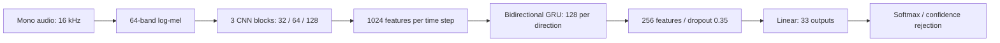

# Voice Command Module — CRNN

On-device voice command classification using a CNN + bidirectional GRU, trained on DGX2 and evaluated on a Raspberry Pi 5.

**Current model: `bestsynth` (`optionb_99.9`).** This is a provisional checkpoint. The prepared CRNN4 dataset below will be used for the replacement model; it is **not** the dataset on which this checkpoint was trained.

## Run

Python 3.10+ and a supported PyTorch installation are required. On the Pi, use the existing PyTorch environment if available.

```bash
git clone https://github.com/markandrian30/vcm-crnn.git
cd vcm-crnn
python -m pip install -r requirements.txt
python benchmark.py --min-confidence 0.25
```

The benchmark downloads the holdout parquet and verifies its SHA-256 against the saved evaluation version. If upstream changes, provide the original file with `--parquet /path/to/holdout.parquet`. For already extracted evaluation audio, use `--audio-dir /home/mark/bestsynth/holdout_direct` on the original Pi.

```bash
python predict.py recording.wav --min-confidence 0.25
```

Confidence **below 25%** is rejected as `OUT_OF_SCOPE`; equality is accepted. This is an inference rule, not an additional trained class. The threshold was explored on the holdout after inspecting its results; these are exploratory benchmark results, not a threshold selected on independent validation negatives.

## Model



| Item | Value |
|---|---|
| Audio | Mono, 16 kHz, variable-length utterances |
| Features | FFT 512; 25 ms window; 10 ms hop; 64 mel bands; 50–7,600 Hz; per-recording feature normalization |
| CNN | Three 3×3 blocks; channel LayerNorm, ReLU, 2×2 max pooling |
| Recurrent layer | One bidirectional GRU; 128 hidden units per direction |
| Outputs | 31 command classes + `HELLO_KIBO` + `SAGITTARIUS` = **33** |
| Parameters | 987,873 |
| Example hardware | USB microphone, Raspberry Pi 5, USB speaker, RGB LEDs and I²C OLED |

The direct benchmark opens no microphone and executes no device actions. The released portable runtime contains only inference and evaluation code.

## Training on the A100 cluster — current bestsynth

| Item | Value |
|---|---|
| Cluster | DGX2 (`ai-n002`); 1 × NVIDIA A100-SXM4, 40 GB; GPU 6 |
| Objective | Cross-entropy; label smoothing 0.05 |
| Optimizer | AdamW |
| Saved training / validation / test recordings | 16,296 / 1,919 / 1,896, including controls |
| Saved training / validation / test speaker IDs | **122 / 15 / 15** |
| Tuning | 16 trials; selected **trial 13** using validation macro F1; seed **42** |
| GRU hidden units per direction | Tested 64, 128 → selected **128** |
| Dropout | Tested 0.25, 0.35 → selected **0.35** |
| Learning rate | Tested 0.001, 0.0005 → selected initial **0.001**; checkpoint rate **0.0005** |
| Weight decay | Tested 0.0001, 0.001 → selected **0.0001** |
| Learning-rate decay | Halved after 4 epochs without validation F1 improvement |
| Early stopping | 10 epochs without validation F1 improvement; maximum 60 epochs |
| Selected checkpoint | Epoch **34**; validation loss **0.1232** |
| GPU time | **2.68 A100 GPU-hours**, author-reported; scheduler accounting is not included |

[Selected configuration](reports/training/best_config.json), [leaderboard](reports/training/leaderboard.csv), [training history](reports/training/history.csv), [training log](reports/training/train.log), and [saved split manifest](reports/training/manifest.csv).

## Preprocessed dataset — prepared for CRNN4

Dataset location: **[processed command manifest](data/command_manifest.csv)**. This link identifies the exact selected subset; audio hosting and a dataset DOI are pending. This repository does not redistribute source audio or change its access terms.

Sources comprise GitHub synthetic recordings and Hugging Face `ai231-me2-voice-commands` recordings. Preprocessing selects normalized exact command phrases and slot values, excludes overlapping HF source filenames already represented in the GitHub inventory, and protects reserved holdout speaker IDs. Filename exclusion is not a claim of decoded-audio deduplication.

| Split | GitHub recordings | HF recordings | Total |
|---|---:|---:|---:|
| Training | 14,070 | 316 | 14,386 |
| Validation | 1,806 | 176 | 1,982 |
| Test | 1,614 | 56 | 1,670 |
| **Total** | **17,490** | **548** | **18,038** |

| Item | Value |
|---|---|
| Duration | **8.90 hours** |
| Command speaker / voice IDs | **252**, partitioned **182 / 37 / 33** |
| Schema | 19 intents: 13 fixed + 6 slotted → 31 command classes; 93 phrase variations |
| HF selection | 615 exact-match candidates; 67 protected holdout-speaker recordings excluded → 548 retained |
| Controls | Counts above exclude 1,044 training-only wake/exit recordings; complete CRNN4 manifest contains 19,082 rows |

[Complete manifest including controls](data/crnn4_full_manifest.csv) and [preparation metadata](data/ready.json). Speaker separation applies to command recordings; controls have a separate training-only policy.

## Direct evaluation on Raspberry Pi 5

These are **direct-file** results for bestsynth at a **25% confidence threshold**, using PyTorch and four CPU threads. Command accuracy requires the correct intent and slot; both accuracy denominators include correct out-of-scope rejections.

### Full holdout — 202 recordings

| Item | Value |
|---|---|
| Command / intent accuracy | **83.66% / 84.65%** |
| False-accept rate | **25% (4/16)** |
| Inference p95 / mean RTF | **57.47 ms / 0.01166** |
| Runtime | **PyTorch · 4 threads · Raspberry Pi 5** |

### Exact phrase-matched commands + out-of-scope — 183 recordings

Includes 167 matching commands and all 16 out-of-scope clips. Only the 19 nonmatching in-scope recordings are excluded.

| Item | Value |
|---|---|
| Command / intent accuracy | **90.16% / 91.26%** |
| False-accept rate | **25% (4/16)** |
| Inference p95 / mean RTF | **57.47 ms / 0.01169** |
| Runtime | **PyTorch · 4 threads · Raspberry Pi 5** |

Timings include log-mel preprocessing, model forward and softmax. Each file uses the median of three repetitions after ten warmups. RTF is the mean of per-file processing-time/audio-duration ratios. Microphone capture, VAD, wake gating and device responses are excluded. Temperature, CPU/RAM and live response latency were not collected.

**Speaker-overlap limitation:** the class holdout contains `s10`, which appears in bestsynth's training speaker IDs, and `s100`, which appears in its saved test speaker IDs. These bestsynth holdout results are therefore **not an entirely unseen-speaker evaluation**. This confirms speaker-ID overlap, not exact audio overlap. CRNN4 excludes the protected holdout IDs; replacing the checkpoint requires rerunning the benchmark.

The saved detailed reports use the class benchmark's scoring conventions. The standalone reproduction script reports exact command-label and intent accuracy, FAR and timing; timing varies with machine load.

[Full predictions](reports/pi/predictions.csv) · [183-recording predictions](reports/pi/phrase_matched_with_oos_predictions.csv) · [Full detailed metrics](reports/pi/full_benchmark_metrics.json) · [183-recording detailed metrics](reports/pi/phrase_matched_with_oos_metrics.json).

## Submission artifacts and status

| Item | Location / status |
|---|---|
| Repository | Public source, MIT licence for repository code |
| Dataset | Processed manifests included; audio release, dataset licence review and DOI pending |
| Weights | [bestsynth checkpoint](model/best_model.pt); provisional model |
| Reproduction | `python benchmark.py --min-confidence 0.25` after installing dependencies |
| Training evidence | Logs, selected configuration, history, tuning leaderboard and manifest included |
| Pi target | Pi **5**, not Pi 4; direct inference reproduced |
| Unseen-speaker evaluation | Pending replacement checkpoint; overlap documented above |
| Comparable-size baseline | Pending |

Code is MIT licensed. Source datasets retain their respective terms; no dataset licence or DOI is implied by the code licence. No separate licence grant for checkpoint weights is asserted in this provisional release.
